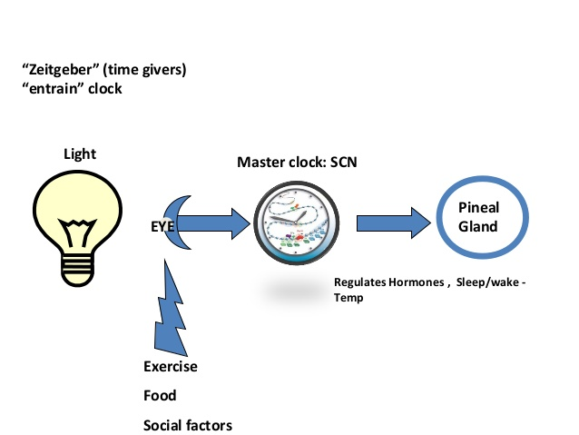

##### 
Pronounced zite-gay-bur  
Zeitgeber literally means time-giver  
Light is by far the most powerful zeitgeber  
Sweden- light 23 hours of the day  
Melatonin (a hormone secreted from the pineal gland in the brain)  
a rhythmically occurring natural phenomenon which acts as a cue in the regulation of the body's circadian rhythms  
Some of the examples of zeitgebers are light, temperature, eating or drinking patterns.  

These external cues help the internal biological clock to be consistent with the rhythmic cycle.  
This process wherein the rhythmic events match the period to an environmental oscillation is called entrainment.  

### Anaya Katlego picture
